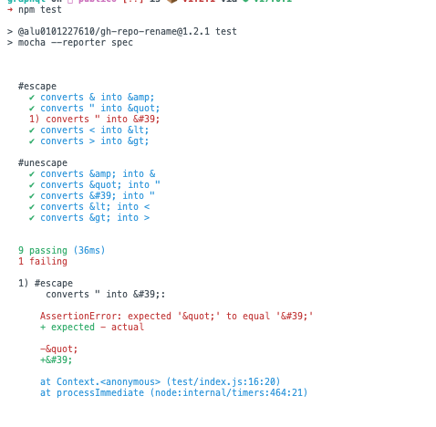

# Creacion de una extension utilizando GraphQL
## Repo Rename
### Github Command Line
#### Antonella García Alvarez
#### alu0101227610

### GraphQL

Es un lenguaje de consultas (query), y alteracion de la informacion de un servicio web. Es un medio de comunicacion entre nosotros y un servicio web (pagina web).
Nos facilita el trabajo solicitando al servicio web solo el objeto que necesitamos, sin averiguar donde estan a diferencia de como hemos accedidos a ellos antes con el JSON.

* Formato de las consultas

Para realizar un query o un mutation, la estructura sera algo parecido a esto:

```graphql
[query|mutation] nombre (argumentos) {
  Operacion
}
```
La operacion empieza cuando ponemos si la operacion es un query o un mutation. Lo siguiente sera el nombre de la operacion, y si queremos ponemos los argumentos que necesitaremos para trabajar. En este caso necesitamos el dueño u owneranizacion y el nombre del repositorio al que queremos acceder.

* Como implementar graphQL con Java Script

Para empezar, guardamos las variables que necesitamos en algo mas general. Es decir, en lugar de poner la owneranizacion la referenciamos. En nuestra extension, para conseguir el ID del repositorio, implementamos esta _query_ que guardamos en una variable getrepoID

```javascript
const getrepoID = (owner, name) => `
query getrepoID{
    repository(owner: "${owner}", name: "${name}"){
      id
    }
  }
 `;
```

Otra consultas que realizamos para el desarrollo de la extension rename es la de conseguir el nombre del repo, y en su defecto, cambiarlo:

```javascript
const renamerepo = (id, newName) => `   
  mutation renamerepo{
    updateRepository(input: 
      {
        name: "${newName}"
        repositoryId: "${id}"
      }
    ) {
      repository{
        name
      }
    }
  }
`;
```

Como vemos, esta consulta es una mutacion. Ya que altera el nombre del repositorio que le indiquemos; Para poder ejecutar estas consultas como siempre añadimos la libreria _shelljs_.

```javascript
const shell = require('shelljs')
```

Y luego, implementando un _shell.exec_ llamamos a la api de graphql a traves de github command line.

```javascript
r = shell.exec(`gh api graphql -f query='${renamerepo(ID, name)}' --jq '.data.updateRepository.repository.name'` , 
  {silent: true}
);

```

Lo que vemos al final de la llamada, es un _silent:true_. Sirve para que no se vea nada reflejado en la terminal, para limpiar un poco la ejecucion del codigo.

### Uso

Nuevamente, adjunto las opciones disponibles en nuestra extension que se ejecuta cuando la llamamos, o cuando ejecutamos la extension sin haber puesto los argumentos necesarios.

```bash
Usage: gh-repo-rename [options]

Options:
  -V, --version             output the version number
  -o, --owner <owneranization>  specifies the owneranization
  -r, --repo <reponame>     specifies the repository
  -n, --name <name>         name
  -h, --help                display help for command

```

### Test with Mocha and Chai

Para publicar nuestro modulo, sería crucial crear pruebas para él. Para ello utilizaremos las herramientas de chai y mocha, el primer paso es instalarlas como dependencias de desarollo o _devDependencies_ en nuestro `.json`.

```js
  "devDependencies": {
    "chai": "^4.3.4",
    "mocha": "^9.1.3",
    "documentation": "*"
  }
```

Además, deberiamos añadir su instalacion como script en el `.json`para asegurarnos de que se pueda ejecutar de forma automatica los test con tan solo poner un alias.

```js
  "scripts": {
    "test": "mocha --reporter spec",
  }
```

Siguiendo los pasos para el desarrollo de los test, creamos un directorio llamado test para guardar un index, en mi caso repo-rename.js, en el cual haremos los test unitarios. En los cuales tendremos bloques descriptivos usando _describe_ donde incluiremos cada funcion respectiva a su entorno. Para mi ha quedado algo así:

```js
describe('#Rename', function() {
it('gets ID from repository', function() {
renameRepo.getRepoID("ULL-ESIT-DMSI-1920", "prueba-antonella-funciona").should.equal('R_kgDOGbeYPw\n');
});
it('converts old name into new name', function() {
  renameRepo.renameRepo("R_kgDOGbeYPw", "prueba-antonella-funciona1").should.equal("prueba-antonella-funciona1");
  });
});
```

Como se ve, son test claros y faciles de crear, y la ejecución es tan sencilla como poner npm test ya que creamos el alias para la ejecución. En la terminal se ve algo como esto:



### Documentación

Para la documentación de nuestro proyecto utilizaremos JsDoc que es una herramienta que genera automaticamente documentación siguiendo el estandar en formato web a partir de los comentarios formateados correctamente en los ficheros necesarios y de nuestro README.

Para instalarla, debemos hacerlo globalmente y luego incluirla en las dependencias de desarrollo de nuestro proyecto.

El correcto formato de nuestros comentarios debe seguir el estandar, que sería así:

```js
/**
 * gets repo ID
 * @param {string} owner 
 * @param {string} name 
 * @returns ID
 */
```

Al tener ya los comentarios deseados ejecutamos `jsdoc fichero.js` y nos creará un directorio llamado `out`donde existiran los recursos de frontend (CSS, HTML y JavaScript) necesarios para visualizar la página de documentación